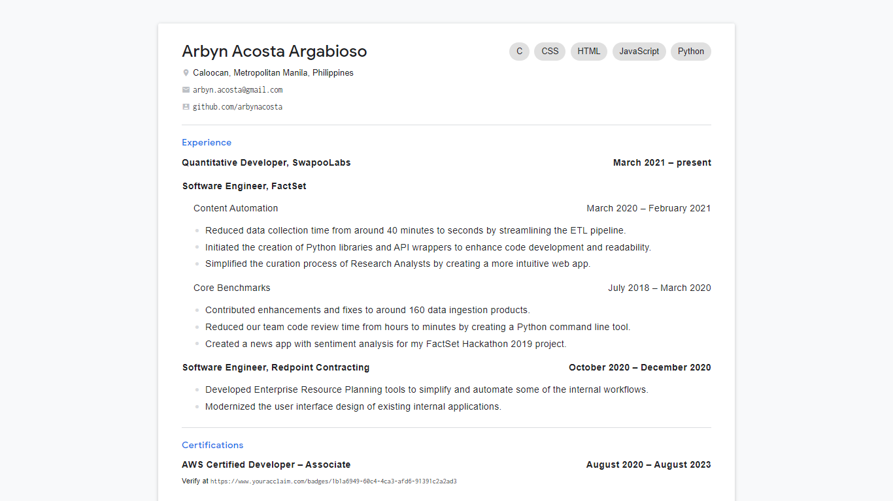
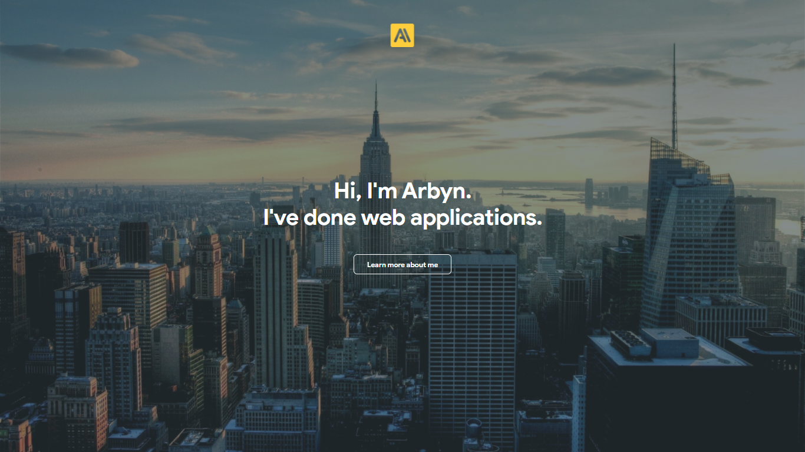
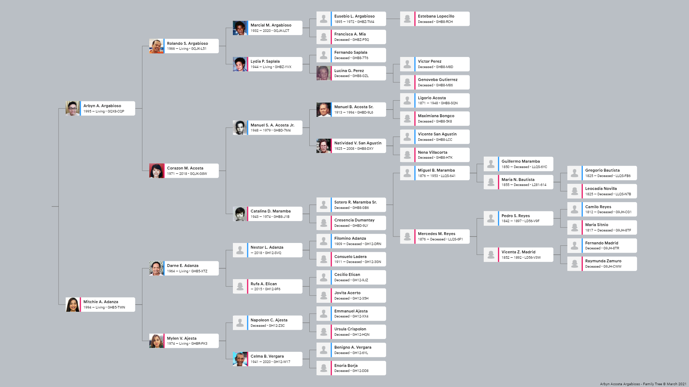

## Online Resume
> The resume structure is inspired by [David Malan's CV](https://cs.harvard.edu/malan/cv/).

 

Instead of directly embeding a PDF into a webpage, I decided to create the actual resume using HTML and CSS to allow better screen resposiveness. You can visit the live webpage on <a href="https://arbynacosta.github.io/resume" target="_blank">https://arbynacosta.github.io/resume</a>.

## Online Portfolio

 

A quick portfolio I made when I was applying as freelancer back in 2017. You can visit the live webpage on <a href="https://arbynacosta.github.io/portfolio" target="_blank">https://arbynacosta.github.io/portfolio</a>.

## Online Family Tree

 

Due to some of my relatives and friends passing away these past few years, I've decided to remember them by creating this family tree web page that dynamically changes based on the available data provided. You can visit the live webpage on <a href="https://arbynacosta.github.com/family?q=arbyn" target="_blank">https://arbynacosta.github.com/family</a>.

